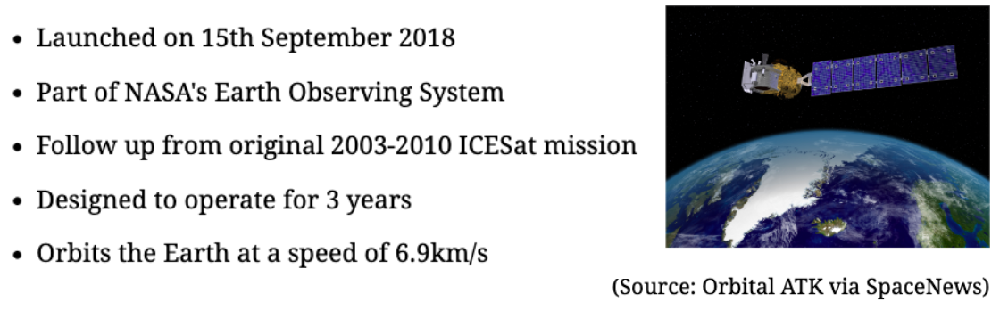
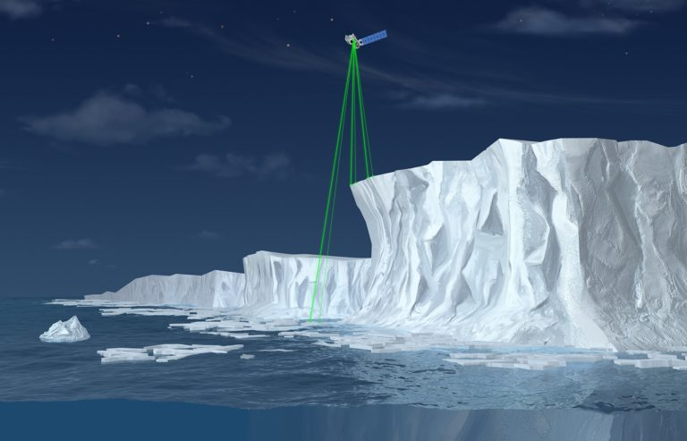
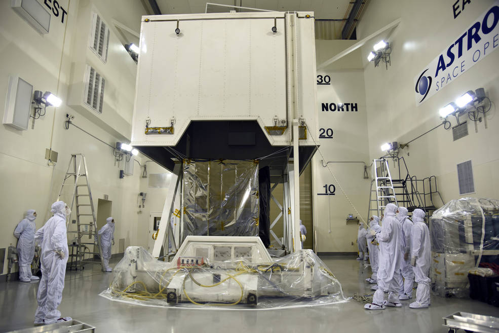

class: align-left
```{r setup, include=FALSE}
options(htmltools.dir.version = FALSE, htmltools.preserve.raw = FALSE)
```

## Sensor summary (1): Mission aims

```{r  echo=FALSE, out.width='140%', fig.align='right', cache=FALSE}

```
Mission objectives
1. Quantify polar ice sheet contributions to sea level change

2. Quantify regional signatures of ice sheet changes to assess mechanisms driving changes, allowing the improvement of predictive ice sheet models

3. Estimate sea-ice thickness

4. Measure vegetation canopy height as a basis for estimating large-scale biomass + biomass change

---
## Sensor summary (2): Technical details
- Sole instrument on board is the Advanced Topographic Laser Altimeter System (ATLAS)
- It emits visible laser pulses at 532nm 
- Does so by generating 6 beams arranged in 3 pairs
- These determine the surface slope and provide more ground coverage 

```{r echo=FALSE, out.width = "40%", fig.align='center', cache=FALSE, fig.cap="(Source: NASA via SpaceflightNow)"}
 
```
- Operates in a near-polar Low Earth Orbit (LEO) at an altitude of 496 km
- Stores 580 Gbits/day
- Has a laser footprint of approximately 17m
- Operates on a repeat cycle of 91 days
- Solar powered
---
## Sensor summary (3): Why ICESat-2 is important
Topographic/climatological constraints limit opportunities for in-situ measurements of ice thickness across the cryosphere. This sensor enables changes in ice cover to be tracked, monitored and quantified at great detail.

.                                          
   

Whilst other current satellites (EG. CryoSat-2, MODIS, Landsat etc.) provide opportunities for remotely monitoring these landscapes, ICESat-2 adds a measure of height to existing data through its sensitive ATLAS instrument which detects individual photons through a rapid firing rate.

  .

Not only does ICESat-2 monitor all forms of frozen water on Earth (land ice, sea ice, frozen reservoirs etc.), it also has valuable application beyond the poles as it can detect the height of forests and thus be used in biomass calculations and estimations of global carbon stores.

---
class: inverse

## Sensor applications (1): Land ice research
.pull-left[
a) New Greenland DEM derived from ICESat-2 (2018-2019)

Fan et al. 2021
- Previous DEMs in Greenland were affected by mass change estimation bias
- Fan et al. utilised ICESat-2 data to generate a final DEM with resolution of 500m
- DEM showed excellent accuracy stability under various topographic conditions
- Valubale for future study regarding changes in elevation and mass balance across Greenland
]

.pull-right[
b) Monitoring of the Antarctic grounding zone (2019-2020)

Li et al. 2022
- Li et al. used ICESat-2 data to produce a high-resolution grounding zone product of the Antarctic Ice Sheet
- Product has a near-complete coverage of the Antarctic Ice Sheet including the difficult-to-survey grounding zones, such as the Amundsen Sea drainage embayment
- Research found a landward grounding line migration along the Amundsen Sea embayment during the past 2 decades
]

---
class: inverse

## Sensor applications (2): Sea ice research
.pull-left[
c) Measuring Antarctic sea ice cover using ICESat-2 + CryoSat-2 (2019)

Kacimi & Kwok, 2020
- Retrieved freeboard, snow depth and ice thickness measurements spanning the winter period of Antarctica
- Discovered that the mechanical convergence in coastal Amundsen sea was associated with onshore winds, corresponding to an increase in snow depth + ice thickness
- Acknowledged research limitation of inability to validate satellite retrievals + results due to the lack of seasonally/regionally diverse datasets
]

.pull-right[
d) Exploratory research monitoring waves in sea ice using ICESat-2 

Horvat et al. 2020
- Observations between ocean surface waves and sea ice are key in determining thermodynamic + dynamic properties of sea ice + relationship to the ocean and atmosphere
- Paper used ICESat-2 data to demonstrate a new technique to produce maps of wave-affected sea ice regions
- Extremely exploratory work but demonstrates potential for producing intuitive maps of Arctic and Southern Ocean wave and marginal ice zone (MIZ) variability
]

---

class: inverse

## Sensor applications (3): Non-cryosphere reserach
.pull-left[
e) Bathymetry with sediment classification using ICESat-2 + multispectral imagery

Li et al., 2023
- Coastal + shallow water bathymetry is key for understanding the marine environment
- Paper revolutionised the collection of bathymetric data (which usually relies on in-situ data) by utilising data from several sources including ICESat-2  to train water depth inversion empirical models
- Results found this technology capable of providing a feasible solution for detecting large-scale water depths
]

.pull-right[
f) Mapping forest canopy height in Canada using ICESat-2 with GEDI, PALSAR + Sentinel

Sothe et al., 2022
- GEDI has no spatial coverage for most forested areas in Canada/other high latitude regions but ICESat-2 does
- Sothe et al., compared ICESat-2 performance against LiDAR + GEDI to produce continuous canopy height maps in Canada for the year 2020
- Research found that whilst GEDI performed better in estimating canopy height, it captured the tall canopy heights expected for these forests better than GEDI
]

---

## Reflections (1): Personal reflection
Despite having completed cryopshere-focused research throughout my undergraduate degree that involved using ICESat-2 data, I'd never thought about the instrument collecting it before. The research for this presentation encouraged me to think about the technology behind the data, for which I'm grateful.
I also want to add something interesting I came across in this research; NASA's 'Operation IceBridge'. This mission sought to maintain continuity of measurements between the first and second ICESat missions using cameras/sensors mounted on planes. Running between 2009-2019, its 2 year overlap with ICESat-2 provided scientists with time to validate the satellite’s measurements. The photos from this mission are amazing and reminded me of how impressive it is that we’re able to monitor changes in these dramatic and otherwise inaccessible locations.

```{r echo=FALSE, out.width = "40%", fig.align='center', cache=FALSE, fig.cap="(Source: NASA via ICESat-2)"}
# IMAGE SOURCE: https://icesat-2.gsfc.nasa.gov/science
knitr::include_graphics("plane.png")
```

---
## Reflections (2): Future applications of ICESat-2 data
Two potential opportunities for future applications of ICESat-2 data stood out to me across the literature I consulted, the details of which are below:

Novel study of sea-ice interactions
- Hovant et al.'s research outlined the potential for this
- Their work displays clear potential to define the marginal ice zone mechanistically which would be really interesting
- Given the impossibility of measuring this in-situ and the dearth of past study using remote sensing, this represents a research gap

Estimating biomass in places lacking GEDI coverage
- Sothe et al.'s paper suggested that ICESat-2 demonstrated enormous potential for mapping forest canopy height where GEDI doesn’t record measurements
- Further research expanding on this would be addressing a significant data gap
- This could represent a valuable opportunity to better constrain global carbon stores/stocks

---
class: inverse
## Thank you!

```{r echo=FALSE, out.width = "80%", fig.align='center', cache=FALSE, fig.cap="(Source: US Air Force/Vanessa Valentine via Geospatial World)"}

```

---
## References (1)
eoPortal (2013) ‘ICESat-2 (Ice, Cloud and land Elevation Satellite-2). Web article, available at: https://www.eoportal.org/satellite-missions/icesat-2#icesat-2-ice-cloud-and-land-elevation-satellite-2

Fan, Y., K, C-Q., Shen, X. (2022) ‘A new Greenland digital elevation model derived from ICESat-2 during 2018-2019’. Earth System Science Data, vol. 14, is. 2,. Pp. 781-794.

Geospatial World (2018) 'NASA to launch advanced laser satellite for measuring change in Earth's ice'. Web article, available at: https://www.geospatialworld.net/blogs/nasa-launch-advanced-laser-satellite/

Horvat, C., Blanchard-Wrigglesworth, E., Petty, A. (2020) ‘Observing waves in sea ice with ICESat-2’. Geophysical Research Letters, vol. 47, is. 10, pp. 1-7

ICESat-2 (2023) ‘Science'. Web article, available at: https://icesat-2.gsfc.nasa.gov/science

Kacimi, S., Kwok, R. (2020) ‘The Antarctic sea ice cover from ICESat-2 and CryoSat-2: freeboard, snow depth and ice thickness’. The Cryosphere, vol. 14, pp. 4453-4474.

---

## References (2)
Li, T., Dawson, G.J., Chuter, S.J., Bamber, J.L., (2022) ‘A high-resolution Antarctic grounding zone product from ICESat-2 laser altimetry’. Earth System Science Data, vol. 14, is. 2, pp. 535-557

Li, S., Wang, X.H., Ma, Y., Yang, F. (2023) ‘Satellite-Derived Bathymetry with Sediment Classification Using ICESat-2 and Multispectral Imagery: Case Studies in the South China Sea and Australia’. Theory and Applications of Satellite Laser Altimetry in Oceanography and Limnology, vol. 15, is. 4, pp. 1020-1026.

Markus, T., Neumann, T., Martino, A., Adbalati, W., Brunt, K., Csatho, B., Farrell, S., Fricker, H., Gardner, A., Harding, D., Jasinki, M., Kwok, R., Magruder, L., Lubin, D., Luthcke, S., Morison, J., Nelson, R., Neuenschwander, A., Palm, S., Popescu, S., Shum, C., Schutz, B.E., Smith, B., Yang, Y., Zwally, J. (2017) ‘The Ice, Cloud and land Elevation Satellite-2 (ICESat-2): Science requirements, concept and implementation’. Remote Sensing of Environment, vol. 190, pp. 260-273 

Sothe, C., Gonsamo, A., Lourenço, R.B., Kurz, W.A., Snider, J. (2022) ‘Spatially Continuous Mapping of Forest Canopy Height in Canada by Combining GEDI and ICESat-2 with PALSAR and Sentinel’. Remote Sensing, vol. 14, is. 20, pp. 5150-5158

---
## References (3)
Spaceflight Now (2018) 'Scientists eager to renew global ice measurements with ICESat-2 mission'. Web article, available at: https://spaceflightnow.com/2018/09/14/scientists-eager-to-renew-global-ice-measurements-with-nasas-icesat-2-mission/

SpaceNews (2014) 'Paying for ICESat-2 overruns delays international Earth science launches'. Web article, available at: https://spacenews.com/41729paying-for-icesat-2-overruns-delays-international-earth-science-launches/
